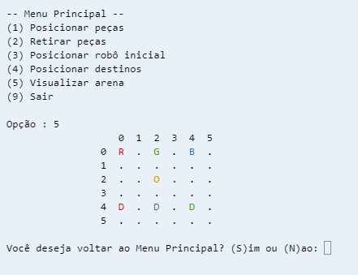

Cenário:

Imagine uma determinada indústria que precisa movimentar peças de três cores diferentes (verde, azul e vermelho) que estão espalhadas pela fábrica. Para isso existe um robô que pode trafegar, capturar as peças e levar aos seus destinos de posicionamento. 

Este módulo do aplicativo insere objetos e mostra um simulador de um espaço de uma fábrica (arena) na tela do usuário.

